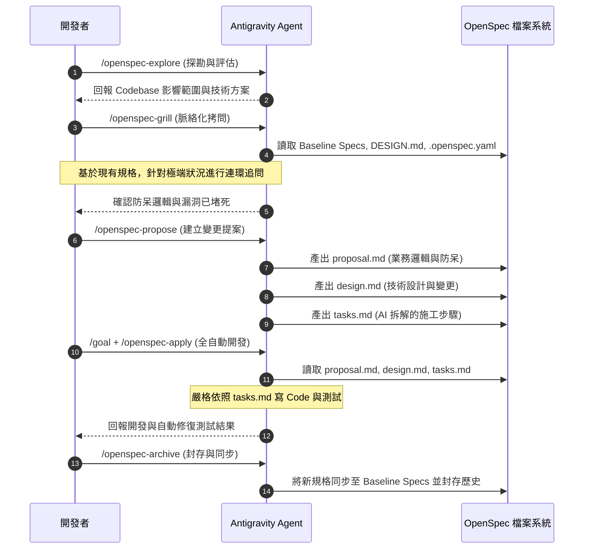

# 🚀 規格驅動開發 (SDD) 終極工作流
**核心工具：** Antigravity CLI × OpenSpec × /openspec-grill

---

## 🔄 核心執行階段

### 階段 1：摸底與架構探勘 (Explore)
**指令：** `/openspec-explore <新需求>`
* **動作**：Agent 會掃描目前的 Codebase、資料庫 Schema 與現狀架構。
* **目的**：了解現狀，評估修改的影響範圍，並提出技術草案或方案選項。
* **輸出**：為下一階段的技術架構打底，最終會演變成 `design.md`。

### 階段 2：脈絡化無情拷問 (openspec-grill)
**指令：** `/openspec-grill [--mode=預設|security|db] [--level=1|3|5]`
* **動作 (讀取)**：Agent 強制先去讀取 `openspec/specs/` (基準業務規則)、`DESIGN.md` (技術架構) 與 `.openspec.yaml`。此階段不讀取 `tasks.md`。
* **動作 (對話)**：Agent 會自動接續前一步驟 (Explore) 所探索出的「技術草案」或「新點子」，並扮演架構審查員，拿著「現有規格」進行衝撞，找出潛在衝突與防呆漏洞。
* **限制**：絕對不寫任何程式碼。

### 階段 3：標準提案落地 (Propose)
**指令：** `/openspec-propose 邏輯確認無誤，建立標準提案。`
* **動作 (產出)**：Agent 將前兩階段的對話與共識，一鍵產出**「Markdown 三位一體」**：
  1. **`proposal.md`**：繼承自 `/openspec-grill`，防呆條件與業務邏輯 (What & Why)。
  2. **`design.md`**：繼承自 `/openspec-explore`，技術架構與變更點 (How)。
  3. **`tasks.md`**：Agent 拆解的施工步驟 Check-list (Steps)。

### 階段 4：全自動開發與測試 (Goal + Apply)
**指令：** `/goal 依照任務使用 /openspec-apply，並完成所有測試。`
* **動作 (讀取與寫入)**：Antigravity Agent 化為超級工程師。遵守 `proposal.md` 守則、看著 `design.md` 藍圖，**嚴格對照 `tasks.md` 寫 Code**。
* **錯誤修復**：自動改 Code、跑測試，報錯就自己修，直到 `tasks.md` 全部打勾。

### 階段 5：封存與同步 (Archive)
**指令：** `/openspec-archive`
* **動作**：將本次變更封存，並將修改內容自動同步至 `openspec/specs/` 的主規格中，作為下次 `/openspec-grill` 讀取的鐵律。

---

## 🗺️ 系統流程圖

