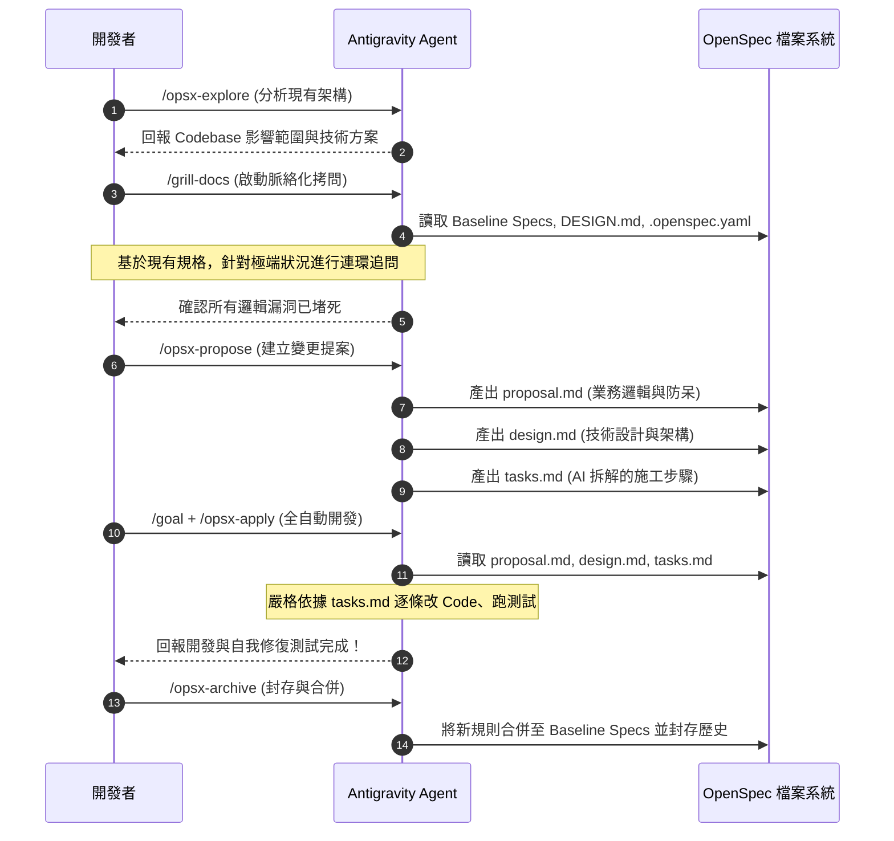

# 🚀 規格驅動開發 (SDD) 終極工作流
**核心工具：** Antigravity CLI × OpenSpec × /grill-docs

---

## 🔄 核心執行階段

### 階段 1：摸底與架構探勘 (Explore)
**指令：** `/opsx-explore <新需求>`
* **動作**：Agent 會掃描目前的 Codebase、資料庫 Schema 與現有架構。
* **目的**：了解現狀，評估修改的影響範圍，並提出技術草案或方案選項。
* **輸出**：為下一階段的技術架構打底，最終會演變成 `design.md`。

### 階段 2：脈絡化無情拷問 (Grill-docs)
**指令：** `/grill-docs [--mode=預設|security|db] [--level=1|3|5] <確定要執行的方向>`
* **動作 (讀取)**：Agent 強制先去讀取 `openspec/specs/` (基準業務規則)、`DESIGN.md` (技術架構) 與 `.openspec.yaml`。此階段不讀取 `tasks.md`。
* **動作 (對話)**：Agent 扮演架構審查員，拿著「現有規格」衝撞你的「新想法」，找出潛在衝突與防呆漏洞。
* **限制**：絕對不寫任何程式碼。

> 💡 **操作訣竅：如何寫好「確定要執行的方向」？**
> 建議使用黃金三要素來啟動拷問，避免過度模糊：
> 1. **目標** (要做什麼功能)
> 2. **依附點** (要改動現有系統的哪裡)
> 3. **初步解法** (如：剛才 Explore 選定的方案，或預計做法)
> *範例：`> /grill-docs --mode=db 決定採用 Redis 逾時方案，請針對購物車 30 分鐘自動釋放庫存的邏輯拷問我。`*

### 階段 3：規格提案落檔 (Propose)
**指令：** `/opsx-propose 邏輯確認無誤，建立變更提案。`
* **動作 (產出)**：Agent 將前兩階段的對話共識實體化，在變更資料夾產出**「Markdown 三位一體」**：
  1. **`proposal.md`**：來自 `/grill-docs`，記錄邊界條件與防呆邏輯 (What & Why)。
  2. **`design.md`**：來自 `/opsx-explore`，記錄技術架構與變更點 (How)。
  3. **`tasks.md`**：Agent 自動拆解的施工步驟 Check-list (Steps)。

### 階段 4：全自動執行與測試 (Goal + Apply)
**指令：** `/goal 依據提案執行 /opsx-apply，並完成所有測試。`
* **動作 (讀取與執行)**：Antigravity Agent 成為超級工程師。讀取 `proposal.md` 守規矩，看著 `design.md` 的藍圖，最後**嚴格對照 `tasks.md` 逐條執行**。
* **自我修復**：自動改 Code、跑測試，報錯就自己修，直到 `tasks.md` 全部打勾。

### 階段 5：封存與合併基準 (Archive)
**指令：** `/opsx-archive`
* **動作**：將這次的變更封存，並把新規則自動合併回 `openspec/specs/` 基準目錄中，成為下次 `/grill-docs` 讀取的新法律。

---

## 📊 系統流程圖

